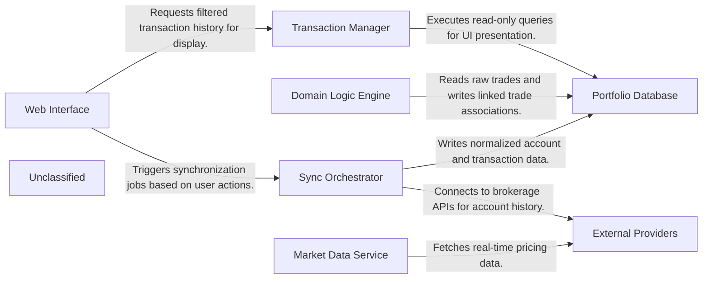

## Details

The PortfolioTracker application employs a Service-Layer Architecture designed to separate the complexity of external data synchronization from user-facing portfolio management. The system operates on a "Sync-Process-Present" flow: raw financial data is ingested via the Sync Orchestrator, refined into meaningful strategies (like option spreads) by the Domain Logic Engine, and served to the user through a Web Interface powered by FastAPI and HTMX. This separation ensures that the heavy lifting of API integration and data normalization does not impact the responsiveness of the user interface, while the Portfolio Database acts as the central source of truth for both raw transactions and derived investment insights. The PortfolioTracker is a Hypermedia-Driven Application (HDA) where the server renders HTML directly, leveraging FastAPI for the backend and HTMX for dynamic interactivity. The architecture is centered around a robust Service Layer that isolates business logic from the HTTP transport layer. Data flows from External Providers into the Portfolio Database via the Sync Orchestrator, where it is subsequently refined by the Domain Logic Engine into high-level concepts like "Linked Trades" and "Trade Groups." The Web Interface remains thin, primarily orchestrating these services to render views, ensuring a clean separation between data ingestion, domain processing, and user presentation.

### Web Interface
The user-facing layer handling HTTP requests, rendering Jinja2 templates, and managing HTMX partial updates. It acts as the controller, delegating logic to services.

**Related Classes/Methods**:

- <a href="https://github.com/Collint25/PortfolioTracker/blob/main/app/routers/sync.py" target="_blank" rel="noopener noreferrer">`app/routers/sync.py`</a>
- <a href="https://github.com/Collint25/PortfolioTracker/blob/main/app/routers/transactions.py" target="_blank" rel="noopener noreferrer">`app/routers/transactions.py`</a>

### Sync Orchestrator
The core write-service responsible for synchronizing local state with external brokerage accounts. It handles API authentication, data fetching, and normalization.

**Related Classes/Methods**:

- <a href="https://github.com/Collint25/PortfolioTracker/blob/main/app/services/sync_service.py" target="_blank" rel="noopener noreferrer">`app/services/sync_service.py`</a>
- <a href="https://github.com/Collint25/PortfolioTracker/blob/main/app/services/snaptrade_client.py" target="_blank" rel="noopener noreferrer">`app/services/snaptrade_client.py`</a>

### Domain Logic Engine
Encapsulates complex business logic for organizing raw trades into meaningful portfolios. This includes auto-linking option legs and managing user-defined trade groups.

**Related Classes/Methods**:

- <a href="https://github.com/Collint25/PortfolioTracker/blob/main/app/services/linked_trade_service.py" target="_blank" rel="noopener noreferrer">`app/services/linked_trade_service.py`</a>
- <a href="https://github.com/Collint25/PortfolioTracker/blob/main/app/services/trade_group_service.py" target="_blank" rel="noopener noreferrer">`app/services/trade_group_service.py`</a>

### Transaction Manager
A read-optimized service providing filtered, sorted, and paginated transaction data to the UI. It abstracts complex database queries.

**Related Classes/Methods**:

- <a href="https://github.com/Collint25/PortfolioTracker/blob/main/app/services/transaction_service.py" target="_blank" rel="noopener noreferrer">`app/services/transaction_service.py`</a>

### Market Data Service
A specialized service for fetching and caching real-time asset prices and historical market data to value positions.

**Related Classes/Methods**:

- <a href="https://github.com/Collint25/PortfolioTracker/blob/main/app/services/market_data_service.py" target="_blank" rel="noopener noreferrer">`app/services/market_data_service.py`</a>

### Portfolio Database
The relational data store (SQLite/SQLAlchemy) holding all application state, from raw account data to derived trade groupings.

**Related Classes/Methods**:

- <a href="https://github.com/Collint25/PortfolioTracker/blob/main/app/models/transaction.py" target="_blank" rel="noopener noreferrer">`app/models/transaction.py`</a>
- <a href="https://github.com/Collint25/PortfolioTracker/blob/main/app/models/linked_trade.py" target="_blank" rel="noopener noreferrer">`app/models/linked_trade.py`</a>

### External Providers
Third-party APIs providing financial data and brokerage connections.

**Related Classes/Methods**:

- <a href="https://github.com/Collint25/PortfolioTracker/blob/main/app/services/snaptrade_client.py#L6-L12" target="_blank" rel="noopener noreferrer">`SnapTrade API`:6-12</a>
- <a href="https://github.com/Collint25/PortfolioTracker/blob/main/docs/YAHOO_FINANCE_INTEGRATION.md" target="_blank" rel="noopener noreferrer">`Yahoo Finance`</a>

### Unclassified
Component for all unclassified files and utility functions (Utility functions/External Libraries/Dependencies)

**Related Classes/Methods**: _None_

### [FAQ](https://github.com/CodeBoarding/GeneratedOnBoardings/tree/main?tab=readme-ov-file#faq)