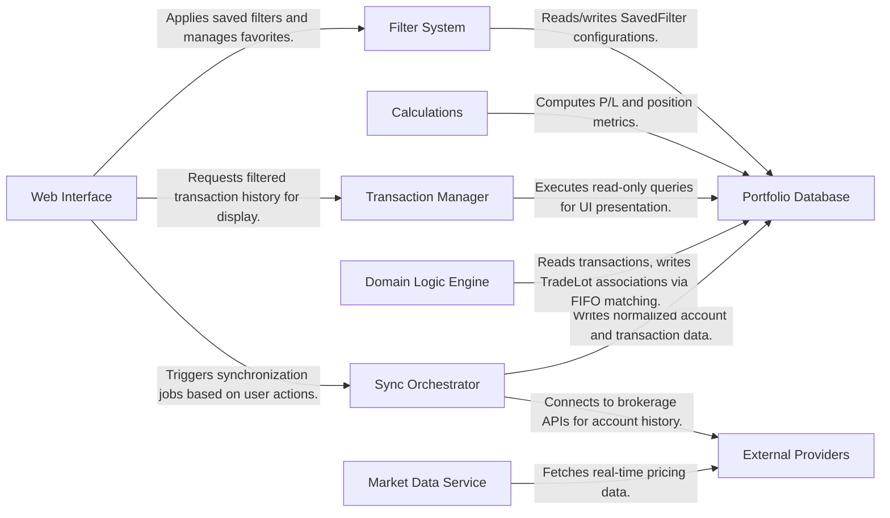

## Details

The PortfolioTracker application employs a Service-Layer Architecture designed to separate the complexity of external data synchronization from user-facing portfolio management. The system operates on a "Sync-Process-Present" flow: raw financial data is ingested via the Sync Orchestrator, refined into meaningful trade lots by the Domain Logic Engine, and served to the user through a Web Interface powered by FastAPI and HTMX.

This separation ensures that the heavy lifting of API integration and data normalization does not impact the responsiveness of the user interface, while the Portfolio Database acts as the central source of truth for both raw transactions and derived investment insights.

### Web Interface
The user-facing layer handling HTTP requests, rendering Jinja2 templates, and managing HTMX partial updates. It acts as the controller, delegating logic to services.

**Related Files:**
- `app/routers/sync.py`
- `app/routers/transactions.py`
- `app/routers/api.py` - autocomplete endpoints

### Sync Orchestrator
The core write-service responsible for synchronizing local state with external brokerage accounts. It handles API authentication, data fetching, and normalization.

**Related Files:**
- `app/services/sync_service.py`
- `app/services/snaptrade_client.py`

### Domain Logic Engine
Encapsulates business logic for organizing raw trades into meaningful portfolios. The TradeLot system tracks share/contract batches through their open→close lifecycle using FIFO matching. LotTransaction records link individual transactions to lots with quantity allocations.

**Related Files:**
- `app/services/lot_service.py` - FIFO lot matching for stocks/options
- `app/models/trade_lot.py` - TradeLot and LotTransaction models

### Transaction Manager
A read-optimized service providing filtered, sorted, and paginated transaction data to the UI. It abstracts complex database queries.

**Related Files:**
- `app/services/transaction_service.py`

### Filter System
Manages SavedFilter configurations, allowing users to save named filter presets with favorite designation. Favorite filters are auto-applied on page load.

**Related Files:**
- `app/services/saved_filter_service.py` - CRUD for saved filters
- `app/services/filters.py` - TransactionFilter dataclass + filter builders
- `app/models/saved_filter.py`

### Calculations
Pure functions for computing profit/loss and position metrics. Separated from services to enable isolated testing and reuse.

**Related Files:**
- `app/calculations/` - P/L and position calculation functions

### Market Data Service
A specialized service for fetching and caching real-time asset prices and historical market data to value positions.

**Related Files:**
- `app/services/market_data_service.py`

### Portfolio Database
The relational data store (SQLite/SQLAlchemy) holding all application state, from raw account data to trade lot associations.

**Related Files:**
- `app/models/transaction.py`
- `app/models/trade_lot.py` - TradeLot and LotTransaction
- `app/models/saved_filter.py`

### External Providers
Third-party APIs providing financial data and brokerage connections.

**Related Files:**
- `app/services/snaptrade_client.py` - SnapTrade API client
